# 🚀 From Prototype to Production: How I Built a Scalable AI Skill (And You Can Too)


Scaling a prototype into a production system typically requires a dedicated engineering team.

For individual contributors, this resource gap is the primary bottleneck. While the architecture exists in our minds, the bandwidth to implement robust testing pipelines, comprehensive documentation, and error handling is often missing.

**Claude Skills** address this by enabling a component-based architecture for AI instructions. By treating prompts as modular, versioned, and tested software components, we can replicate the rigor of a full engineering team within a single workflow.

I applied this methodology to engineer the *Israeli Tech Career Consultant*, a complex system capable of deep market analysis. This article details the architectural decisions and engineering practices required to build it. 👇

---

## 💡 The Technical Case for Skills
 
Before we dive into the "how," let's talk about why this matters. Claude Skills aren't just "saved prompts." They represent a fundamental shift in how we architect AI applications. (See the [official guide](https://www.claude.com/blog/skills-explained) for a deep dive, or explore open-source libraries like [Rowboat](https://github.com/rowboatlabs/rowboat) for similar patterns).

1.  **Dynamic Loading (Context Efficiency)**: Instead of stuffing 50 pages of instructions into the context window, Skills load only what's needed *when* it's needed. It's comparable to lazy loading in software development.
2.  **Token Compactness**: By modularizing instructions, we save massive amounts of tokens. My skill runs complex analyses using <70% of the context window, leaving room for deep reasoning.
3.  **Sandboxed Code Execution**: This is the key differentiator. The AI doesn't just "guess" answers; it writes and runs Python code in a secure container to *calculate* them. It turns the LLM from a storyteller into a data scientist.

---

## 🛠️ 8 Practices for Production-Grade AI

The following eight practices form the engineering blueprint used to deliver v1.0.

### 1. Use Chat as Your GUI (Don't Build a Frontend)

Why build a React app when Claude renders HTML? I used `html_generator.py` to generate **interactive, self-contained HTML reports** directly in the chat.


Users get a full dashboard with sorting, filtering, and export capabilities—zero frontend code required.

### 2. Progressive Context Loading

I don't force Claude to read a 50-page manual. I use a **Progressive Context Loading** architecture to reduce ramp-up time to zero.

```mermaid
graph TB
    %% Styles
    classDef local fill:#e3f2fd,stroke:#1565c0,stroke-width:2px,color:black;
    classDef remote fill:#f3e5f5,stroke:#7b1fa2,stroke-width:2px,color:black;
    classDef container fill:#e8f5e9,stroke:#2e7d32,stroke-width:2px,color:black;

    subgraph Local["💻 Local Device"]
        direction TB
        Client[Claude Desktop]
        subgraph MCP["MCP Layer"]
            FS[Filesystem MCP]
            Net[Network MCPs]
        end
        Files[(User Files / SKILL.md)]
        
        Client <--> FS
        Client <--> Net
        FS <--> Files
    end

    subgraph Remote["☁️ Remote Servers"]
        direction TB
        Model[Claude 3.5 Sonnet]
        Services["External APIs<br/>(Firecrawl / Bright Data)"]
    end

    subgraph Sandbox["📦 Secure Container"]
        Python[Python Analysis Sandbox]
    end

    %% Connections
    Client <==>|"1. Chat & Context"| Model
    Model -.->|"2. Load Modules"| FS
    Model -.->|"3. Fetch Data"| Net
    Net -.-> Services
    Model -.->|"4. Process Data"| Python

    %% Coloring
    class Client,FS,Net,Files local;
    class Model,Services remote;
    class Python container;
```



This architecture operates in three distinct tiers:

1.  **Main Context (Always Loaded)**: Only the lightweight `CLAUDE.md` is loaded initially. This acts as a router.
2.  **Skill Discovery (Metadata Only)**: The system scans YAML frontmatter to identify the right tool *without* loading content.
3.  **Active Skill Context (Loaded on Demand)**: When a skill is triggered, it loads the full `SKILL.md`.
4.  **External MCPs (Integrations)**: The skill connects to **Firecrawl** (for deep web research) and **Bright Data** (for LinkedIn scraping) via the Model Context Protocol to fetch real-time data.

This keeps the context window clean while giving the AI infinite reach.

### 3. Test Like It's Software (Debug Mode)

You can find this in the repo as `skill-package/modules/debug-mode.md`. It's my "critical tool" for functional testing: **Debug Mode**.

I created a special project in Claude that points to the skill folder and tells Claude: *"You are now in debug mode."* This allows me to:
*   Test specific functions in isolation (e.g., "Run the score calculator with these inputs").
*   Do rapid "hot-fix" testing before committing changes.
*   Verify fixes instantly without running the full pipeline.

It's like having a REPL for your AI skill.

### 4. Give Your AI a Memory (Structured Filesystem)

Stateless AI is forgetful AI. I connected my skill to the **@modelcontextprotocol/server-filesystem**, but I didn't just dump text into files. I used a **Hybrid Storage Strategy**.

**The Rule**: Use YAML for machines, Markdown for the LLM.

#### A. YAML for Process Control
I use `backlog.yaml` to track strict, structured data that my Python scripts need to parse reliably.

```yaml
# user-data/jobs/backlog.yaml
jobs:
  - url: "https://linkedin.com/jobs/view/123"
    status: "pending"  # Script reads this to know what to scrape next
    added_date: "2023-10-27"
```

#### Apple Notes Integration (v9.25)
For even simpler capture, I added **Apple Notes inbox** support. Just paste URLs into a note called "Job Links Inbox" and say `process inbox`. The skill reads the note via MCP, processes each URL, and moves them to a "Processed" section. Mobile-friendly job capture without opening Claude.

#### B. Markdown for Semantic Knowledge
I use Markdown for rich, descriptive data that Claude needs to read and understand.

```markdown
# user-data/companies/NVIDIA.md
## Strategic Focus
NVIDIA is pivoting from just GPUs to full-stack AI infrastructure...

## Cultural Fit
High intensity, engineering-driven culture. Values "speed of light" execution.
```

This structure allows my Python scripts to manage the *workflow* (via YAML) while Claude manages the *wisdom* (via Markdown). Next time I ask about NVIDIA, it loads the Markdown file instantly, saving **15,000 tokens**.


### 5. Prioritize Token Optimization

Tokens are money. I built a `token_estimator.py` module that runs before every major operation.

**The Strategy**:
1.  **Estimate**: Calculate the cost of the input + expected output.
2.  **Check Budget**: Compare against a defined limit (e.g., 50k tokens).
3.  **Fail Fast**: If it's too expensive, warn the user *before* starting.

```python
# skill-package/scripts/token_estimator.py
def estimate_tokens(text: str) -> int:
    """
    Estimate number of tokens in text.
    Uses ~4 characters per token as rough estimate.
    """
    if not text:
        return 0
    
    # Remove extra whitespace
    text = re.sub(r'\s+', ' ', text)
    return len(text) // 4
```

This simple check prevents "context window overflow" errors that crash long-running sessions. It's about reliability.

### 6. GitHub is Your Source of Truth

This isn't just a folder on my desktop. It's a Git repository with full CI/CD.

*   **History**: I can roll back to v9.0 if v10.0 breaks something.
*   **Branches**: I develop new features (like "Market Investigation") on separate branches.
*   **Workflows**: I use `validate.yml` for CI and `release.yml` to automatically package the skill.
*   **Dependency Tracking**: A graph ensures documentation stays in sync with code changes.
*   **One-Click Releases**: The `/ship` command handles version bumps, changelogs, and tags automatically.

Maintain everything in GitHub. Your future self will thank you when you need to see *why* you made a change 3 months ago.

### 7. Setup for AI-First Development Workflow

Writing for AI is different from writing for humans. I followed **AI Documentation Best Practices** to create a "Grounding Layer" for my Agentic IDE.

**The 3 Golden Rules**:
1.  **Grounding**: Don't just describe; give concrete examples.
2.  **Structure**: Use consistent headers and bullet points (LLMs love structure).
3.  **Intent**: Explain *why*, not just *what*.

**My Implementation**:
I upload the `docs/project/` folder to a **Claude Project**. This acts as the "Long-Term Memory" for the agent.

*   **`FEATURES.md` (The Specs)**: Grounded with specific examples.
    > *Bad*: "The system scores jobs."
    > *Good*: "6-component scoring system (Match, Income, Growth...) evaluates opportunities. Scores 0-100 determine priority."
*   **`ROADMAP.md` (The Plan)**: Clear timeline and intent.
    > *Example*: "Next Release (v10.0): Interview preparation module."
*   **`STATUS.md` (The State)**: Current context to prevent hallucinations about what's done.

**Why?** When I ask "add the interview prep module," Claude checks `ROADMAP.md` for the plan and `FEATURES.md` for the style. It doesn't guess; it follows the grounded context.


This documentation isn't for humans—it's for the AI to help me build faster.

### 8. Use an Agentic IDE (The Orchestrator)

I didn't write all this code alone. I used **Claude Code** and **Google Antigravity** in parallel to orchestrate the entire lifecycle. It doesn't just "autocomplete code"; it manages the project state.

**The Agentic Workflow**:
1.  **Planning**: The IDE reads `ROADMAP.md` and updates `FEATURES.md`.
2.  **Execution**: It writes code, runs tests, and debugs failures in a loop.
3.  **Maintenance**: It automatically updates `STATUS.md`, `CHANGELOG.md`, and bumps `version.yaml`.


We are moving from "coding" to "orchestrating." The IDE handles the grunt work of keeping docs, tests, and code in sync, allowing me to focus on the architecture.

**Note**: Even this blog post was drafted, refined, and committed by the same Agentic IDE workflow.

---
 
### 9. Architecture: Edge Deployment vs. Centralized SaaS

Most AI apps today are built on the **SaaS Model** (e.g., LangChain on AWS). You send your data to a central server, it processes everything, and sends back an answer.

I flipped this model. I use an **Edge Deployment** architecture.

*   **Centralized Intelligence**: Claude (the LLM) provides the reasoning power.
*   **Local Execution**: The skill logic runs on *your* machine (via Claude Desktop).
*   **Local Data**: Your files never leave your computer (except to go to the LLM context).

**The Trade-off**:
*   **SaaS**: Easy to update, but you pay for infra and lose data sovereignty.
*   **Edge**: Zero infra cost, 100% privacy, but requires user installation.

**Data Separation Strategy**:
To make this work, I strictly separate the "Skill" from the "User Data":
1.  **Skill Package (`/mnt/skills/...`)**: Immutable templates and logic. Shared by everyone.
2.  **User Data (`~/Documents/user-data/`)**: Mutable, personal files. Created separately for each user.

This means I can push a code update to the skill *without* touching your personal database. It's the best of both worlds: SaaS-like updates with local-first privacy.

---

## 🎯 The Result: Scalable Engineering Capacity

A robust, production-ready skill that I actually use. It doesn't hallucinate, it doesn't crash, and it gets smarter the more I use it.

This is how you drive change in your organization. You don't wait for headcount. You don't wait for budget. You build an **AI Virtual Team**—a Developer, a QA Engineer, a Data Scientist, and a Product Manager—all wrapped into one robust skill.

**You are no longer just one person. You have the capacity of a squad.**


---

## 🛑 Moving Beyond the Hype

Let's be real: our feeds are drowning in "AI will replace you" posts. It's easy to get tired of the noise.

But if we look past the hype, there is a quiet revolution happening in **Software Engineering**.

1.  **It's Still Engineering**: The diagrams above (Edge Deployment, MCPs) prove that building with AI isn't magic—it's architecture. It requires CI/CD, testing, and version control just like any other production system.
2.  **Respect the Craft**: We aren't replacing software engineers; we are evolving the toolkit. The "Agentic IDE" is just the next layer of abstraction, like moving from Assembly to C++.
3.  **The "One-Person Army"**: This isn't about "doing more with less" for the sake of productivity. It's about **autonomy**. It's about having the power to execute on your ideas—end-to-end—without being blocked by a lack of resources.

The future isn't "AI writing code for you." It's you, orchestrating a team of AI agents to build things you never thought possible.

**That is a future worth building.** 🚀

---

**What's your biggest challenge in scaling AI skills? Let's discuss in the comments! 👇**

#AI #GenerativeAI #SoftwareEngineering #Claude #Productivity #TechCareers #LLM #PromptEngineering
