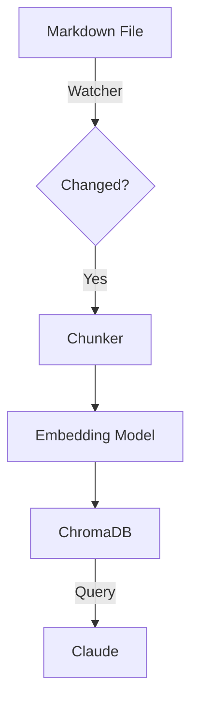

# The "Second Brain" Architecture: A Deep Dive into 5 Custom AI Skills


*Part 2 of the "AI-Augmented Homosapiens" series. [Read Part 1 here](LINK_TO_PART_1).*

---

In the [first article](LINK_TO_PINNED_POST), I outlined the high-level architecture of my local-first AI system. Today, we're opening the hood.

I don't use generic AI tools. I use **5 specialized skills**—modular, versioned code containers that run locally and connect my LLM to my digital life.

Here is the technical breakdown of each production skill and the patterns that power them.

---

## 🏗️ The Core Pattern: What is a "Skill"?

Before diving in, let's define the architecture. A "Skill" in my monorepo isn't just a prompt. It's a structured package:

```python
# The Anatomy of a Skill
class Skill:
    def __init__(self):
        self.system_prompt = load_prompt("system.md") # The "Brain"
        self.tools = load_tools("tools.py")           # The "Hands"
        self.memory = load_memory("context.md")       # The "Memory"
        self.config = load_config("config.yaml")      # The "Settings"
```

All skills share a common **MCP (Model Context Protocol)** layer for file access, web scraping, and Apple Notes integration.

---

## 🟢 Production Skills (Live & Daily Use)

### 1. Career Consultant 💼
**Purpose**: Systematically analyze job postings and optimize applications.

**The Problem**: Applying to jobs is a black box. You forget what you applied to, and tailoring CVs is slow.
**The Solution**: A skill that maintains a structured database of my career profile and matches it against scraped job descriptions.

**Architecture**:

*   **Input**: LinkedIn URL (via Bright Data MCP)
*   **Data**: `profile.yaml` (3 CV variants: EM, TPM, AI Engineer)
*   **Logic**: Scoring algorithm (0-100) based on Keywords, Seniority, and Tech Stack.
*   **Output**: Match Score + Tailored Cover Letter Strategy.

**Code Snippet (Scoring Logic)**:
```python
def score_job(job_desc, user_profile):
    # Vector similarity for semantic match
    semantic_score = rag.similarity(job_desc, user_profile.experience)
    
    # Hard constraints check
    hard_skills_score = check_constraints(job_desc, ["Python", "LLM", "System Design"])
    
    return (semantic_score * 0.7) + (hard_skills_score * 0.3)
```

### 2. Local RAG (Memory) 🧠
**Purpose**: Semantic search over my entire personal knowledge base.

**The Stack**:
*   **Vector DB**: ChromaDB (running locally)
*   **Embeddings**: `all-MiniLM-L6-v2` (fast, runs on CPU)
*   **Storage**: Markdown files in `~/brain`

**Workflow**:

1.  **Ingest**: Watcher script detects file changes.
2.  **Chunk**: Split by H2 headers (semantic chunking).
3.  **Embed**: Generate vectors.
4.  **Retrieve**: Claude calls `query_rag(query)` tool.

**Performance**: 2-second retrieval for 1000+ documents.

### 3. Reading List Manager 📚
**Purpose**: Triage the firehose of information.

**The "Inbox" Pattern**:
1.  **Capture**: I paste URLs into a specific Apple Note ("Reading Inbox").
2.  **Process**: The skill reads the note via Apple Notes MCP.
3.  **Scrape**: Uses Firecrawl to get full text.
4.  **Synthesize**: Summarizes (150 words) + Categorizes + Prioritizes.
5.  **Archive**: Moves processed links to `archive.md`.

**Result**: I only read what matters. The rest is indexed for later search.

### 4. Voice Memos Intelligence 🎙️
**Purpose**: Capture fleeting thoughts and turn them into action.

**The Challenge**: Voice memos usually die in the app.
**The Fix**:
*   **Input**: Audio files (m4a) from iCloud Drive.
*   **Process**: Whisper (local) or API for transcription.
*   **Intelligence**: Claude analyzes the text.
    *   *Hebrew/English mixed support*
    *   *Action Item Extraction*
    *   *Topic Categorization*

### 5. Ideas Capture 💡
**Purpose**: Structured thinking partner.

**Workflow**:
*   I dump a raw idea (chat or voice).
*   Skill asks clarifying questions (Socratic method).
*   Skill formats it into a structured **One-Pager**:
    *   Problem Statement
    *   Proposed Solution
    *   Risks
    *   Next Steps
*   Saves to `ideas/` directory as Markdown.

---

## 🟡 Bonus: Meeting Recorder

The Voice Memos skill includes a **Meeting Recorder** component—a production-grade macOS menu bar app built in Swift that captures audio from meeting applications (Zoom, Google Meet, Teams).

**Features**:
- **ScreenCaptureKit**: Uses Apple's modern API (no BlackHole needed)
- **Swift 6 Concurrency**: Full Sendable compliance for thread-safe audio capture
- **Auto-Detection**: Detects when meeting apps start
- **Smart Compression**: 64kbps AAC optimized for speech (~30MB/hour)
- **Auto-Chunking**: Long meetings split into processable chunks
- **Menu Bar UI**: Unobtrusive recording controls with status indicators

**Architecture**:
```swift
// AudioCapture.swift - Thread-safe audio routing
@MainActor
final class AudioCapture: NSObject, Sendable {
    func captureAudio(from app: SCRunningApplication) async throws
}
```

**Use Case**: "What did we agree on in the standup?" → Process meeting recordings → Query transcripts via RAG.

---

## 🛠️ How It All Fits Together

This isn't a collection of scripts. It's a **System**.

*   **Shared Library**: All skills use `shared/utils` for logging, config, and MCP clients.
*   **Unified Context**: The RAG skill is available to *all* other skills. The Career Consultant can ask RAG "What projects did I do with Python?" to tailor a CV.
*   **Single Interface**: I interact with everything through one Claude Desktop window.

## 🛡️ Strategic Advantages: Why This Architecture Wins

Beyond the cool factor, there are three hard strategic reasons I built it this way:

### 1. Radical Data Sovereignty
My life isn't locked in a proprietary database.
*   **Format**: Everything is plain text (YAML, Python, Markdown).
*   **Access**: I can edit my "memory" with a text editor.
*   **Exit Strategy**: If I want to leave, I just `zip` the folder. No "Export Data" requests, no API limits, no dependency on Notion/Google/Microsoft ecosystems.

### 2. Decoupled Architecture (The "Anti-Fragile" Design)
The AI landscape changes every week. This system is designed to survive the churn.
*   **LLM Agnostic**: While I use Claude today, the skills are written in generic Python. They can be repointed to OpenAI, Gemini, or a local Llama model with minimal changes.
*   **Tool Agnostic**: I use Apple Notes for convenience, but swapping it for Google Keep or a text file is just changing one MCP connector. The core logic stays the same.
*   **Future Proof**: Skills can be converted into local Docker containers wrapped with MCP, making them accessible from *any* client, not just Claude Desktop.

### 3. Enterprise-Ready by Default (The Bonus)
Because this is an **edge design** (local code, local data), it solves the biggest blocker for enterprise AI adoption: **Data Privacy**.
*   This entire system can run behind a corporate firewall.
*   Connect it to an internal enterprise LLM, and you have a full agentic workforce without a single byte of data leaving the building.

---

## 🚀 Next Up: The Monorepo

Managing 5+ skills can be a nightmare. In the next article, I'll show you the **Monorepo Architecture** that keeps this maintainable: CI/CD, shared dependencies, and standardized testing.

**Follow to catch Part 3 next week.**

---

*Questions about a specific skill? Ask in the comments and I'll share the prompt structure.* 👇

#AI #Engineering #LocalFirst #Python #LLM
