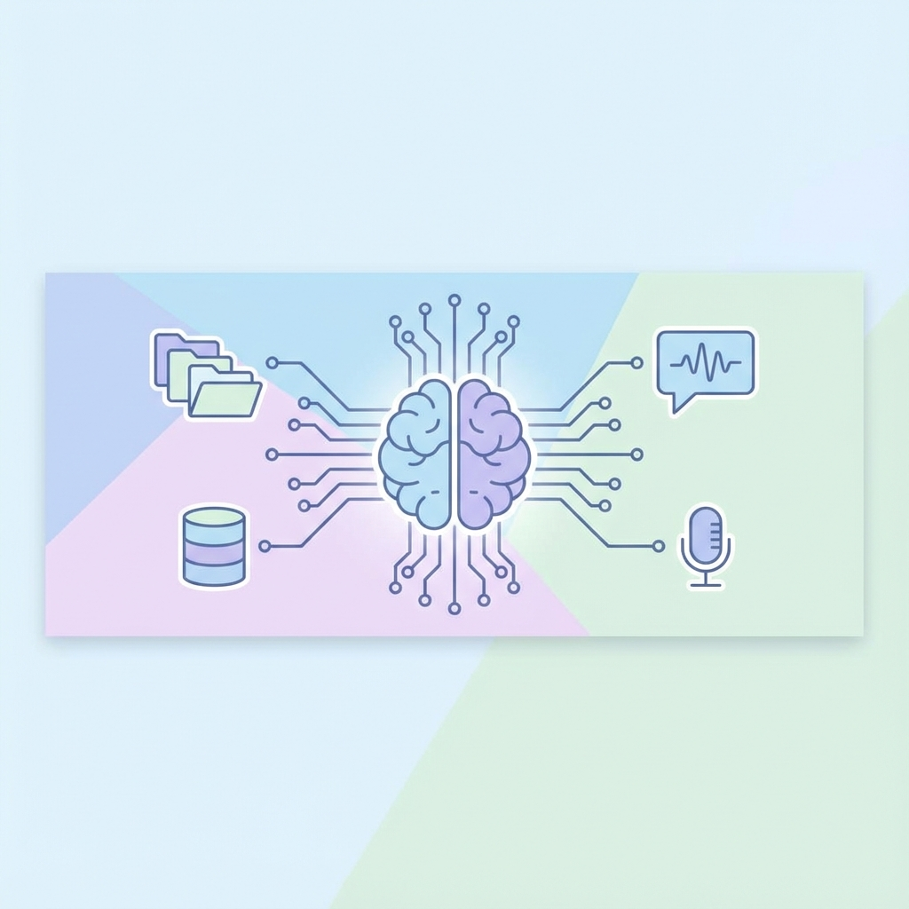
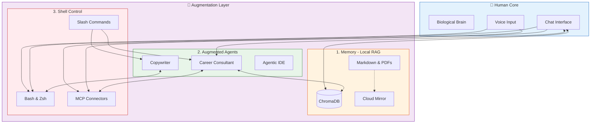

# AI-Augmented Homosapiens: Memory + Agents + Shell Control



*Building a persistent, local-first cognitive system for human-AI collaboration*

---

A month ago, I stopped using AI as a chatbot and started building **AI-Augmented Homosapiens 2.0**.

This isn't marketing speak. It's a technical architecture for knowledge work based on three pillars:

1.  **Memory** = Local RAG (Semantic search over your entire digital life)
2.  **Augmented Agents** = Modular, versioned instructions that extend LLM capabilities
3.  **Shell Control** = Direct computer access via terminal, MCP connectors, and slash commands

Here is the architecture, the workflow, and why every digital worker needs this.

---

## 🏗️ The Architecture

Most AI is stateless. You ask, it answers, it forgets.
I built a **persistent, local-first system** that runs on my machine and grows with me.



### Key Technical Specs
*   **Local-First**: Data stored in Markdown/YAML on disk. No cloud lock-in.
*   **Cloud-Ready**: Knowledge base can sync to Google Drive/Dropbox for access anywhere.
*   **Privacy**: 100% ownership. Your second brain lives on your SSD.
*   **Search**: Semantic retrieval (embeddings) finds concepts, not just keywords.
*   **Computer Use**: Models trained for shell execution (Claude Code, Codex CLI) that can run commands, edit files, and manage your system.

---

## ⚡ A Day in the Augmented Life

**Morning (iPhone)**: Shower thought about a new feature. I dictate a voice memo.
*   **System**: Transcribes (Hebrew/English) → Extracts Action Items → Adds to Product Backlog.

**10 AM (Task & Priority Management)**: "Review my priorities."
*   **System**: Scans Product Backlog, Work Backlog, and Calendar.
*   **Result**: Generates a prioritized "Focus List" for the day, flagging 2 blockers.

**11 AM (Knowledge Triage)**: "Process my reading list."
*   **System**: Scrapes 47 URLs from Apple Notes → Summarizes → Prioritizes.
*   **Result**: 2 hours of reading compressed into 2 minutes of triage.

**1 PM (Career Opportunities)**: "Analyze these 3 job postings."
*   **System**: Loads cached company research (15k tokens saved) → Scores against my CVs → Generates cover letter strategy.
*   **Result**: 92/100 Match score calculated in seconds.

**3 PM (Digital Collaterals)**: "Generate the architecture documentation and slides."
*   **System**: Reads the codebase → Generates Mermaid diagrams → Writes technical blog post → Creates slide outline.
*   **Result**: 4 hours of documentation work done in 15 minutes.

**Evening (Reflection)**: "What business ideas did I have this week?"
*   **System**: RAG retrieves that morning shower thought + 3 others. Nothing is lost.

---

## 📊 The Results (1 Month In)

| Metric | Before | After (Augmented) |
| :--- | :--- | :--- |
| **Research Time** | 15-20 hours/week | **~2 hours/week** |
| **Career Opportunities** | 2 hours/job | **2 minutes/job** |
| **Collateral Gen** | Hours/doc | **Minutes/doc** |
| **Knowledge Retrieval**| "Where was that file?" | **2-second semantic search** |
| **Storage** | Scattered notes | **1GB Local Knowledge Graph** |
| **Cost** | Time & Stress | **$20/mo (Claude)** |

---

## 🖥️ The Shell Control Revolution

The real unlock isn't just "AI that talks." It's **AI that acts**.

Models like Claude are now trained specifically for **computer use**—understanding terminal commands, file systems, and development workflows. This changes everything.

### Slash Commands: Your Personal CLI

Instead of typing prompts, I invoke `/commands`:

```bash
/ship career-consultant patch    # Full release cycle
/refactor                        # Update all dependent docs
/deps                           # Check dependency status
/process-inbox                  # Process Apple Notes inbox
```

Each command is a markdown file that expands into detailed instructions. It's like having programmable macros for your AI.

### Why Shell Control Matters

1.  **Precision**: Commands are repeatable. "Analyze this job" vs `/analyze-job URL`
2.  **Composability**: Chain commands into workflows. `/scrape` → `/analyze` → `/report`
3.  **Version Control**: Commands live in `.claude/commands/`. Git tracks changes.
4.  **Team Sharing**: Share your command library. Onboard teammates instantly.

### The Architecture Pattern

```
Human Intent
    ↓
/slash-command
    ↓
Expanded Prompt (from .md file)
    ↓
LLM Reasoning
    ↓
Shell Execution (bash, git, npm, etc.)
    ↓
Result
```

This is the bridge between "chatting with AI" and "AI as your terminal co-pilot."

---

## 📈 The Trajectory: Constant Evolution

Building this system feels like being Columbus discovering a new continent.

**Every day brings new discoveries:**
*   **Compound Growth**: The more I use it, the smarter it gets. My local database grows, my skills library expands, and my productivity compounds.
*   **Infrastructure Refactoring**: As AI models advance (context windows, speed, reasoning), I constantly refactor the infrastructure to unlock new capabilities.
*   **The "Second Rise"**: As AI gets better, *my* baseline performance rises with it.

### The Future Vision (Where This Is Going)

This architecture is a bridge to the future, valid for the coming years. But eventually:
1.  **Agents will self-compose**: AI will generate agent logic on the fly. You won't write prompts; you'll just state intent.
2.  **Shell control will expand**: From terminal to full OS control—window management, app orchestration, system automation.
3.  **Storage will be direct**: The knowledge graph will connect directly to our biological memory (Neuralink style?).

Until then, **we build the bridge.**

---

## 🌍 The Universal Pattern

This isn't just for developers. **Every digital profession is evolving.**

*   **Programmers**: From "Stack Overflow copy-paste" → **Agentic IDEs** (Cursor, Claude Code)
*   **PMs**: From "Manual Jira updates" → **Predictive Risk & Backlog Agents**
*   **Creators**: From "Drafting from scratch" → **Idea-to-Distribution Pipelines**

**A Note on "Augmented Agents"**:
The concept is universal. An "Augmented Agent" is simply **LLM + Instructions + Computer Access**. You can build this with Claude Code, OpenAI Codex CLI, or local models. The architecture remains the same—what matters is that the model can *act*, not just *talk*.

**The Shift**:
*   **Pre-AI**: Brain + Google (Access to info, no context)
*   **Chatbot Era**: Brain + LLM (Reasoning, but no action)
*   **Augmented Era**: Brain + LLM + Shell Control + Persistent Memory (Reasoning + Action + Recall)

---

## ⚠️ Current Limitations (Honesty First)

1.  **Not Production-Ready**: APIs break, models change. It's a developer's toolkit.
2.  **Latency**: Complex chains (Scrape → Analyze → Write) can take 30s+.
3.  **Maintenance**: Requires technical knowledge to fix agents when they break.
4.  **Trust Boundary**: Shell access means mistakes can have real consequences. Start with read-only operations.

---

## 📅 The Series Roadmap

Over the next 5 weeks, I'm open-sourcing the code and architecture:

1.  [**Production-Grade Skills**: Architecture & MCP setup](LINK_PLACEHOLDER)
2.  **The Skills Deep-Dive**: RAG, Career Consultant, Voice Memos.
3.  **Monorepo Patterns**: Managing the codebase.
4.  **Lessons Learned**: Failures & optimizations.
5.  **The Philosophy**: Why local-first matters.

**First article drops Monday.**

Let's build the future of work, locally. 🚀

---

**What's your approach to AI augmentation?**
Are you building a second brain, or just using chatbots? Let's discuss. 👇

#AI #LocalFirst #RAG #MCP #FutureOfWork #SoftwareEngineering #ClaudeCode #AugmentedAgents
