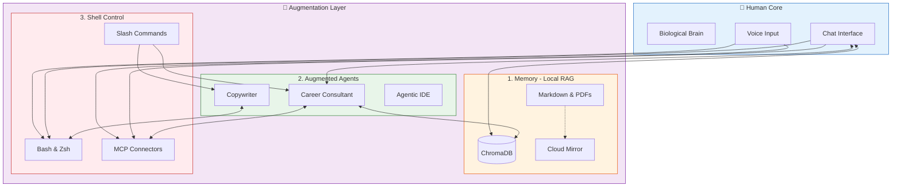

# AI-Augmented Homosapiens: Memory + Agents + Shell Control


*Building a persistent, local-first cognitive system for human-AI collaboration*

---

A month ago, I stopped using AI as a chatbot and started building **AI-Augmented Homosapiens 2.0**.

The inspiration comes from **biological evolution**. Humans have evolved through three distinct pillars, and my project extends each one with AI:

1.  **Brain** → Extended by **LLM** (Reasoning & Processing)
2.  **Memory** → Extended by **Local Filesystem & Open Formats** (Context-aware, perfect recall)
3.  **Tools** → Evolved from physical (Hammer) to digital (Compiler) to **Skills** (AI Agents that act)

Here is why this architecture is different, and why every digital worker needs it.

---

## 🏗️ The Architecture

Most AI is stateless. You ask, it answers, it forgets.
I built a **persistent, local-first system** that runs on my machine and grows with me.



### 🦄 What Makes This Unique?

This isn't another productivity app like Notion or Obsidian. It's an **open architecture**:

1.  **Local-First & Open**: All context is stored in open formats (Markdown/YAML) on your drive. You can access it from *any* LLM (Claude, GPT, Llama). You don't need to marry any specific tool.
2.  **Native Cloud Bridges**: It bridges natively to your existing cloud environment. I use **Apple Notes** for capture and **Google Drive** for storage, seamlessly integrated via MCP.
3.  **Privacy & Corporate Ready**: Full privacy enabled. It can be used behind firewalls for people looking to unleash productivity at work without crossing corporate rules or sending data out of the organization.
4.  **Speed of Evolution**: It is the fastest solution to get the latest AI advancements. Because it separates **Data**, **LLM**, and **Code**, you can swap the model the day a new one drops without migrating your data.
5.  **Platform Agnostic**: Using AlignTrue for instruction sync, the skills work seamlessly across **Claude Desktop**, **OpenAI Codex**, **Cursor IDE**, **Google Antigravity**, and other AI coding assistants. Switch models or tools without rewriting your workflows—true vendor independence.

---

## ⚡ A Day in the Augmented Life

**Morning (iPhone)**: Shower thought about a new feature. I dictate a voice memo.
*   **Skill**: `voice-memos`
*   **Action**: Transcribes (Hebrew/English) → Extracts Action Items → Adds to Product Backlog.

**10 AM (Knowledge Triage)**: "Process my reading list."
*   **Skill**: `reading-list`
*   **Action**: Scrapes 47 URLs from Apple Notes → Summarizes → Prioritizes.
*   **Result**: 2 hours of reading compressed into 2 minutes of triage.

**1 PM (Career Opportunities)**: "Analyze these 3 job postings."
*   **Skill**: `career-consultant`
*   **Action**: Loads cached company research (15k tokens saved) → Scores against my CVs → Generates cover letter strategy.
*   **Result**: 92/100 Match score calculated in seconds.

**3 PM (Deep Research)**: "What do we know about Agentic Patterns?"
*   **Skill**: `local-rag`
*   **Action**: Semantic search across my entire local drive (PDFs, Code, Notes).
*   **Result**: Retrieves relevant context that no cloud LLM has access to.

---

## 📊 The Results (1 Month In)

| Metric | Before | After (Augmented) |
| :--- | :--- | :--- |
| **Research Time** | 15-20 hours/week | **~2 hours/week** |
| **Career Opportunities** | 2 hours/job | **2 minutes/job** |
| **Collateral Gen** | Hours/doc | **Minutes/doc** |
| **Knowledge Retrieval**| "Where was that file?" | **2-second semantic search** |
| **Storage** | Scattered notes | **1GB Local Knowledge Graph** |
| **Cost** | Time & Stress | **$20/mo (LLM Subscription)** |

---

## 🖥️ The Shell Control Revolution

The real unlock isn't just "AI that talks." It's **AI that acts**.

Models are now trained specifically for **computer use**—understanding terminal commands, file systems, and development workflows. This changes everything.

### Slash Commands: Your Personal CLI

Instead of typing prompts, I invoke `/commands`:

```bash
/ship career-consultant patch    # Full release cycle
/refactor                        # Update all dependent docs
/deps                           # Check dependency status
/process-inbox                  # Process Apple Notes inbox
```

Each command is a markdown file that expands into detailed instructions. It's like having programmable macros for your AI.

---

## 🌍 The Universal Pattern

This isn't just for developers. **Every digital profession is evolving.**

*   **Programmers**: From "Stack Overflow copy-paste" → **Agentic IDEs**
*   **PMs**: From "Manual Jira updates" → **Predictive Risk & Backlog Agents**
*   **Creators**: From "Drafting from scratch" → **Idea-to-Distribution Pipelines**

**The Shift**:
*   **Pre-AI**: Brain + Google (Access to info, no context)
*   **Chatbot Era**: Brain + LLM (Reasoning, but no action)
*   **Augmented Era**: Brain + LLM + Shell Control + Persistent Memory (Reasoning + Action + Recall)

---

## 📅 The Series Roadmap

Over the next 5 weeks, I'm open-sourcing the code and architecture:

1.  [**Production-Grade Skills**: Architecture & MCP setup](LINK_PLACEHOLDER)
2.  **The Skills Deep-Dive**: RAG, Career Consultant, Voice Memos.
3.  **Monorepo Patterns**: Managing the codebase.
4.  **Lessons Learned**: Failures & optimizations.
5.  **The Philosophy**: Why local-first matters.

**First article drops Monday.**

Let's build the future of work, locally. 🚀

---

**What's your approach to AI augmentation?**
Are you building a second brain, or just using chatbots? Let's discuss. 👇

#AI #LocalFirst #RAG #MCP #FutureOfWork #SoftwareEngineering #AgenticAI #AugmentedAgents
